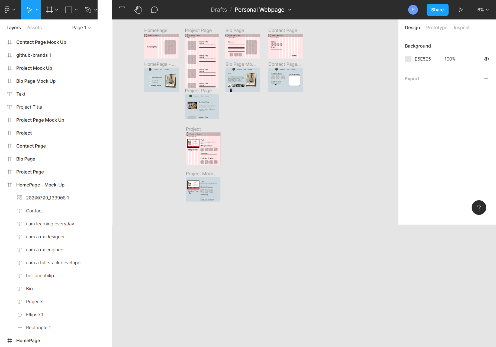
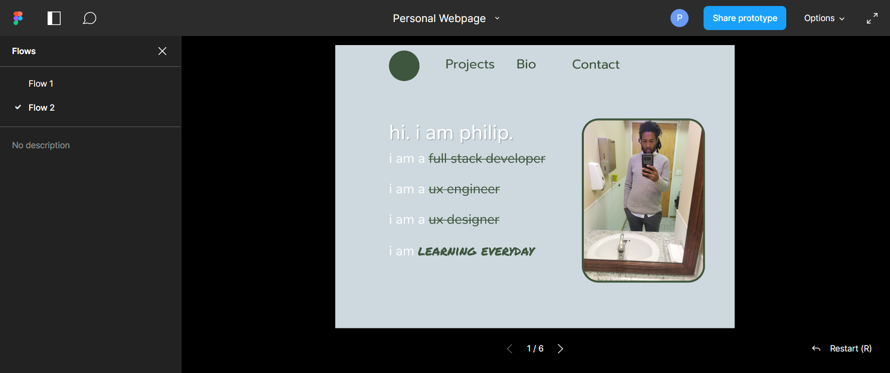
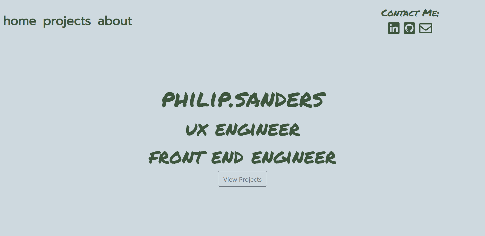
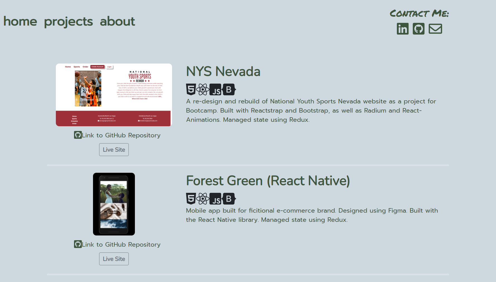
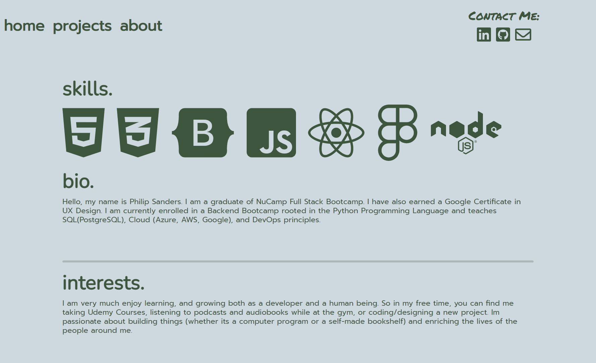

# Personal Portfolio Website

This is a personal website to showcase all of  my personal projects as well as contact information.  This project used **React, ReactStrap, Bootstrap, React Router and CSS**

---

## Features

* Animations made with pure CSS as well as an animation library named react-typist
* Links to both the github repositories and actual deployed website.

---

## Design Process

The site was designed first thru paper wireframes and then full mock-ups using Figma.

----

## Final Website 

